# TRABAJO 2: ESTILOS CALL - RETURN

### Ejercicio 1 - Lectura de componentes de una URL

### Descripción

Crear un objeto de tipo URL en Java e imprimir los valores retornados por los métodos:
- getProtocol()
- getAuthority()
- getHost()
- getPort()
- getPath()
- getQuery()
- getFile()
- getRef()

> **URL Utilizada** : https://github.com:443/usuario/repo/issues?estado=abierto&autor=user#cristian

### Explicación de los Métodos

| Elemento | Valor obtenido | Método utilizado | Descripción |
|-----------|---------------|------------------|-------------|
| Protocolo | `https` | `getProtocol()` | Protocolo utilizado por la URL. |
| Autoridad | `github.com:443` | `getAuthority()` | Autoridad de la URL, compuesta por el host y el puerto. |
| Host | `github.com` | `getHost()` | Nombre del servidor al que apunta la URL. |
| Puerto | `443` | `getPort()` | Puerto especificado en la URL. |
| Ruta | `/usuario/repo/issues` | `getPath()` | Ruta del recurso dentro del servidor. |
| Consulta (Query) | `estado=abierto&autor=user` | `getQuery()` | Parámetros enviados en la consulta HTTP. |
| Archivo | `/usuario/repo/issues?estado=abierto&autor=user` | `getFile()` | Ruta del recurso junto con la cadena de consulta. |
| Referencia (Fragmento) | `cristian` | `getRef()` | Fragmento o referencia ubicado después del símbolo `#`. |

### Pruebas:


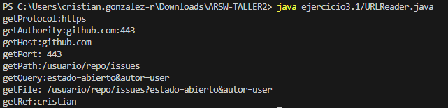

### Conclusiones

1. La clase URL permite descomponer fácilmente una dirección web en sus diferentes componentes.
2. Los métodos de la clase facilitan la obtención de información específica como protocolo, host, puerto y parámetros de consulta.
3. Esta funcionalidad es útil para aplicaciones cliente-servidor, navegadores, crawlers y sistemas que procesan recursos web.

---

### Ejercicio 2 - Lectura de Páginas Web y Almacenamiento en Archivo

### Descripción

El objetivo de este ejercicio es desarrollar una aplicación tipo *browser* que solicite al usuario una dirección URL, lea el contenido de la página web indicada y lo almacene en un archivo HTML local. Posteriormente, el archivo generado puede abrirse en cualquier navegador para visualizar la página descargada.

### Ejemplo de Ejecución

Entrada
```
Ingrese la dirección URL: https://www.instagram.com/?hl=es
```

Salida
```
Archivo 'pagina.html' guardado exitosamente.
```

### Resultado

Después de ejecutar el programa, se genera el archivo: **pagina.html**

Este archivo contiene el código HTML de la página descargada y puede abrirse directamente en un navegador web para visualizar su contenido.

### Pruebas

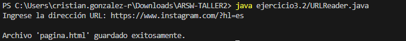

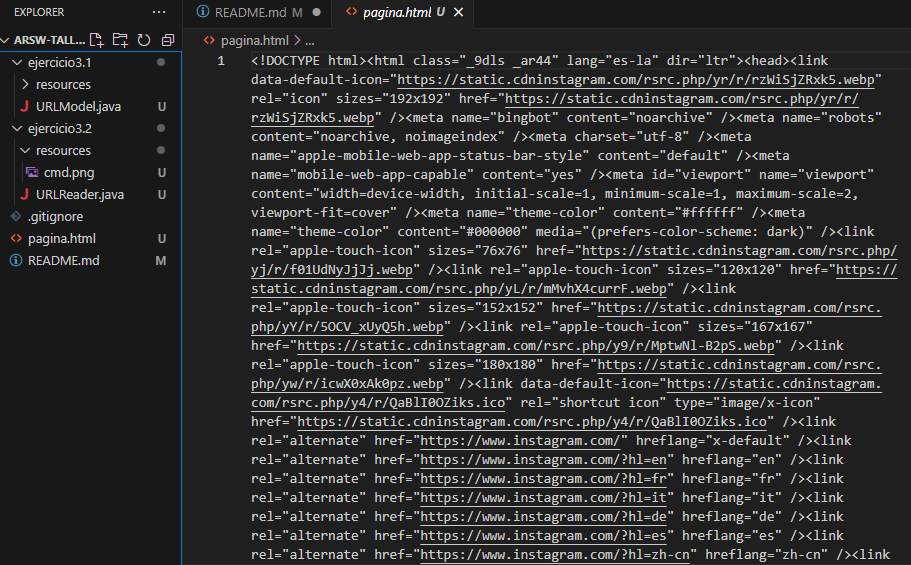

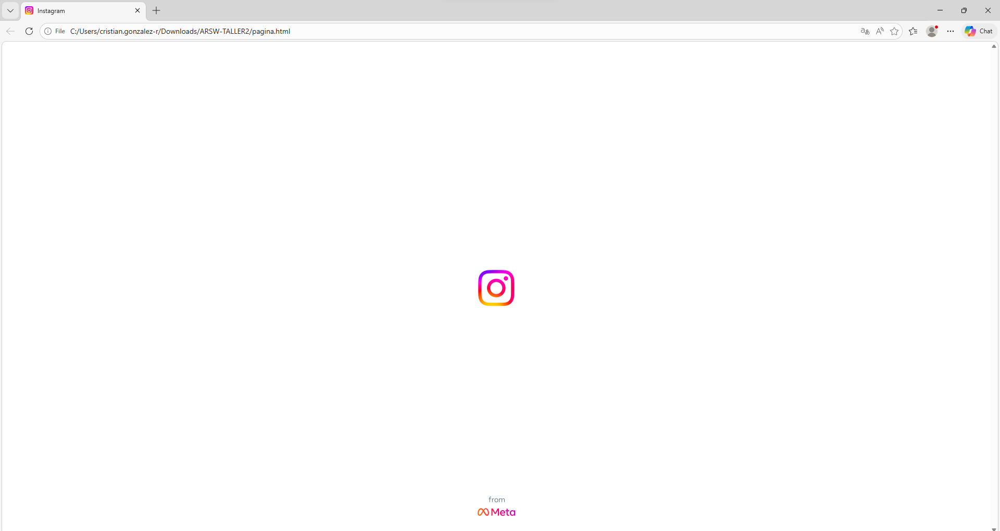

---

### Ejercicio 3.1 - Servidor que recibe un número y responde el cuadrado.

### Descripción
Escriba un servidor que reciba un número y responda el cuadrado de este número.

### Pruebas

### Cliente (EchoClient)
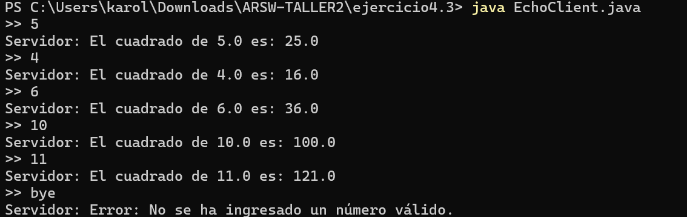
### Servidor (EchoServer)
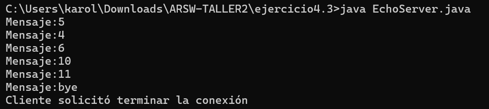

### Conclusiones 

1. Servidor de números: La comunicación mediante sockets TCP permite construir aplicaciones cliente-servidor donde el servidor procesa datos (en este caso, cálculos matemáticos) y responde al cliente. El manejo de excepciones es crucial para evitar fallos cuando el cliente envía datos inválidos.

2. En todos los casos se implementó manejo de excepciones, cierre adecuado de recursos (sockets, streams) y mensajes claros para el usuario.

--- 

### Ejercicio 3.2 - Servidor de Funciones Matemáticas (Seno, Coseno, Tangente)

### Descripción

Escriba un servidor que pueda recibir un número y responda con un operación sobre este número. Este servidor puede recibir un mensaje que empiece por “fun:”, si recibe este mensaje cambia la operación a las especificada. El servidor debe responder las funciones seno, coseno y tangente. Por defecto debe empezar calculando el coseno. Por ejemplo, si el primer número que recibe es 0, debe responder 1, si después recibe π/2 debe responder 0, si luego recibe “fun:sin” debe cambiar la operación actual a seno, es decir a partir de ese momento debe calcular senos. Si enseguida recibe 0 debe responder 0.

### Comandos:

  - fun:sin - Cambia a función seno
  - fun:cos - Cambia a función coseno
  - fun:tan - Cambia a función tangente
  - bye - Terminar conexión

### Pruebas:

### Cliente (EchoClient)
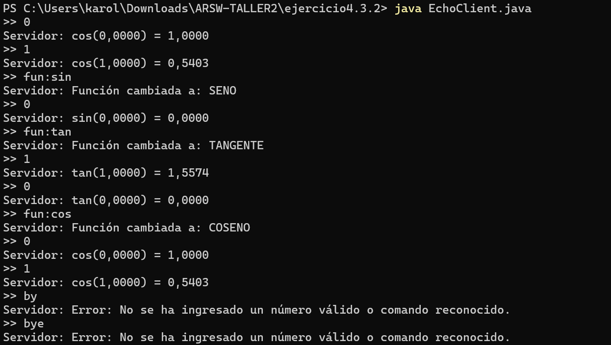
### Servidor (EchoServer)
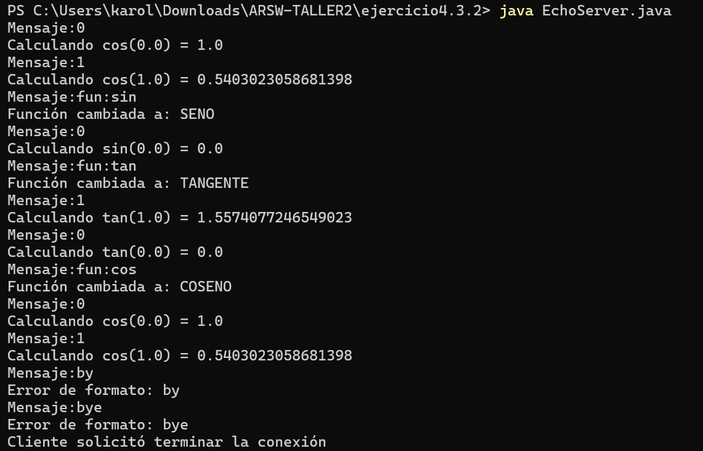

---

### Ejercicio 4.1 - Servidor Web

### Descripción 
El código 4 presenta un servidor web que atiende una solicitud. Implemente el servidor e intente conectarse desde el browser.

### Procedimiento

1. Se guardó el código en el archivo HttpServer.java.
2. Se compiló utilizando el comando: javac HttpServer.java
3. Se ejecutó el servidor mediante: java HttpServer
4. El servidor quedó escuchando conexiones en el puerto 35000.
5. Desde un navegador web se accedió a la dirección: http://localhost:35000
6. El navegador envió una solicitud HTTP al servidor.
7. El servidor recibió la petición, la mostró en consola y respondió una página HTML.

### Pruebas

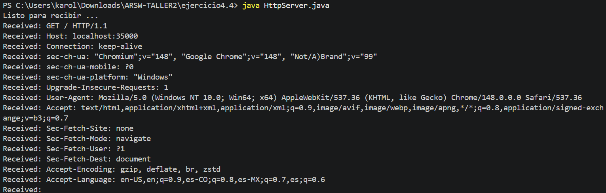

---

### Ejercicio 4.2 - Servidor web que soporte múltiples solicitudes 

### Descripción 
Escriba un servidor web que soporte múltiples solicitudes seguidas (no concurrentes). El servidor debe retornar todos los archivos solicitados, incluyendo páginas html e imágenes.

### Pruebas

### Consola
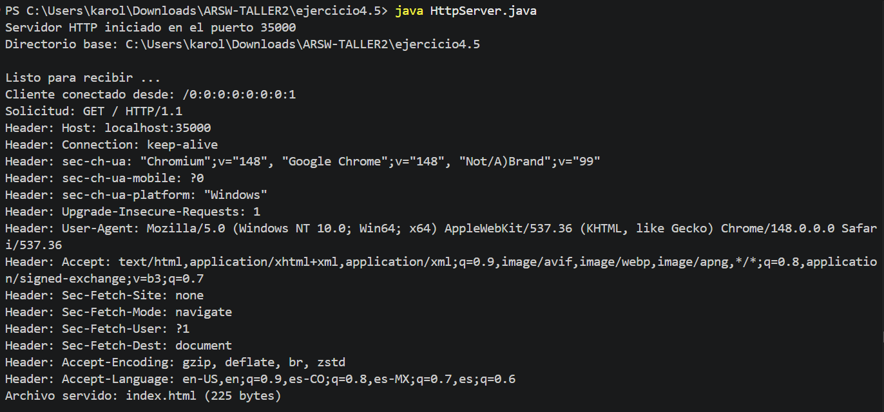
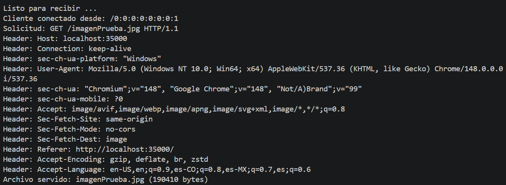
### Pagina Web
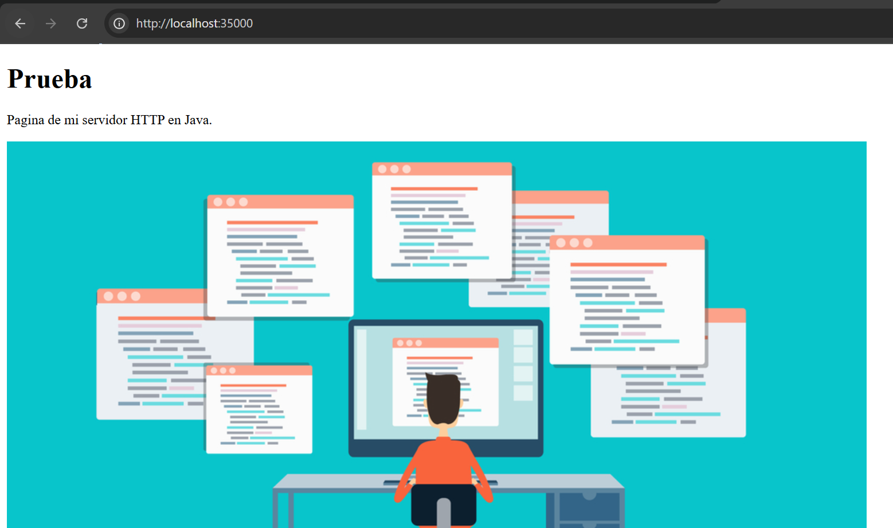

---

### Ejercicio 5 - Datagramas que se conecte a un servidor y responde la hora actual en el servidor.

### Descripción 
Utilizando Datagramas escriba un programa que se conecte a un servidor que responde la hora actual en el servidor. El programa debe actualizar la hora cada 5 segundos segun los datos del servidor. Si una hora no es recibida debe mantener la hora que tenıa. Para la prueba se apagara el servidor y despues de unos segundos se reactivara. El cliente debe seguir funcionando y actualizarse cuando el servidor este nuevamente funcionando.

### Pruebas

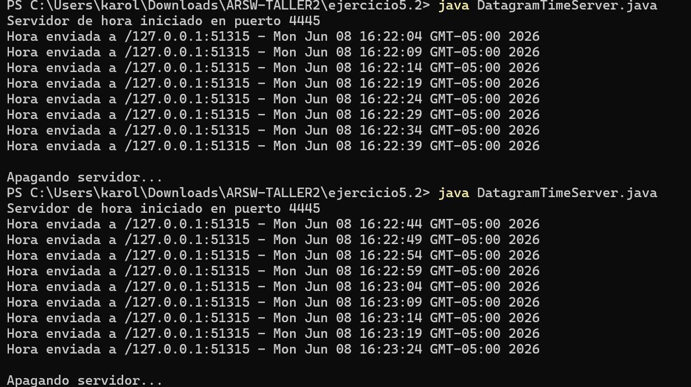

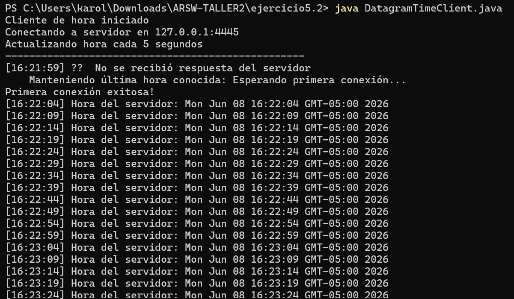

---

### Ejercicio 6 - CHAT

### Descripción 

CHAT: Utilizando RMI, escriba un aplicativo que pueda conectarse a otro aplicativo del mismo tipo en un servidor remoto para comenzar un chat. El aplicativo debe solicitar una direcci´on IP y un puerto antes de conectarse con el cliente que se desea. Igualmente, debe solicitar un puerto antes de iniciar para que publique el objeto que recibe los llamados remotos en dicho puerto.

### Pruebas

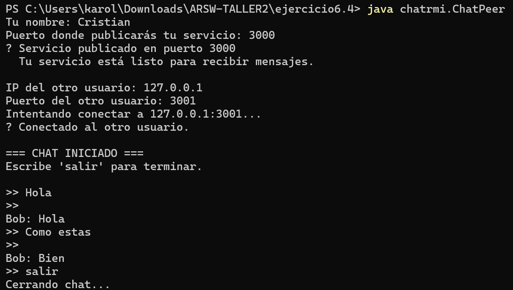

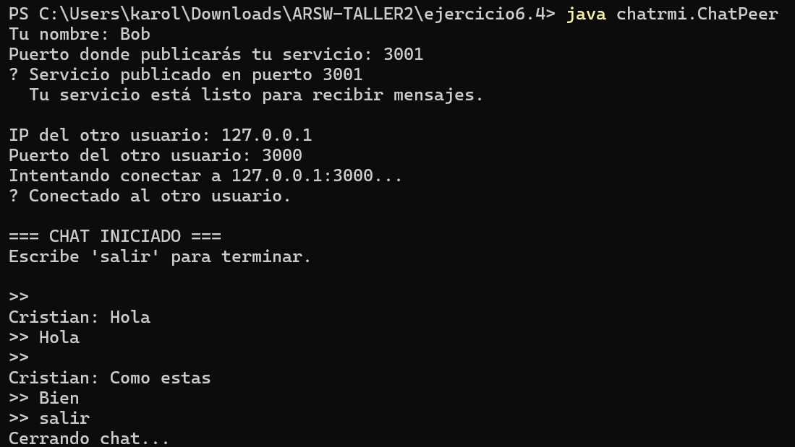

